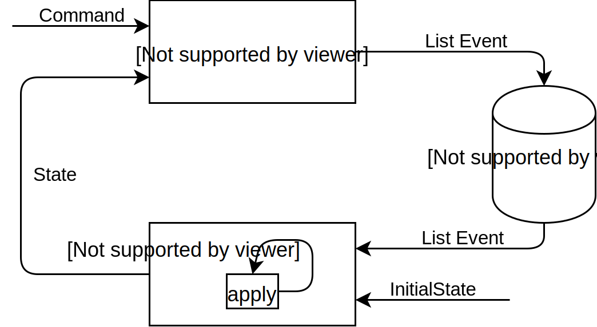

# cqrs-exp

experimental repo using cqrs with nestjs

## Concept

CQRS stands for Command Query Responsibility Segregation

This design pattern supports domain-driven programming.

**Command** is generated from the client-side, it represent the client intention/suggestion.
Which may be accepted or rejected by the domain model.

**Event** is generated from Command.
It should be immutable and persisted.

**Query** is generated from the client-side.
It requests a snapshot of information at the particular time.

**Response** is generated from the domain.
It is the answer of the Query regarding to the particular version of model state.

## TODO
- [ ] setup for command handling
- [ ] setup for query handling
- [ ] test for event handling
- [ ] test the cqrs
  1. create user (boss)
  2. create shop
  3. create service
  4. create user (customer)
  5. create booking

## Reference

Source: http://blog.leifbattermann.de/2017/04/21/12-things-you-should-know-about-event-sourcing/
